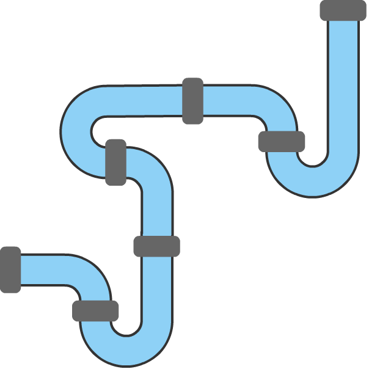
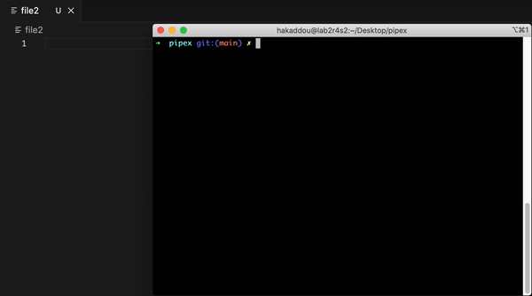

  <h3 align="center">Pipex</h3>
  Pipes, forks, processes, and redirection.
   
   

 

# Pipex

Inspired by Unix shell pipelines, this project starts with basic process creation and redirection. We advance from handling simple input/output to managing complex inter-process communication using pipes. Utilizes fundamental system calls to mimic shell behavior and handle process execution.

 

## How to run

input_file command1 | command2 > output file

- Go to root directory and run `make`
- Run `./pipex file1 "ls -la" "grep pipex" file2`
- Usage: `./pipex input_file command1 command2 output file`
- Mimics the UNIX process: `< input_file command1 | command2 > output file`

 
