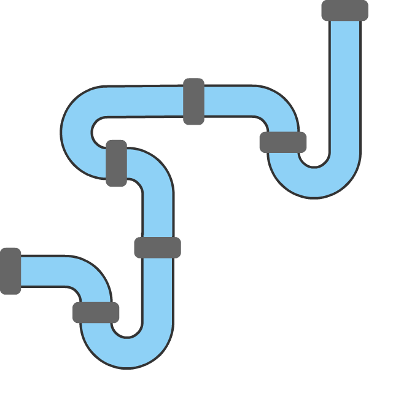
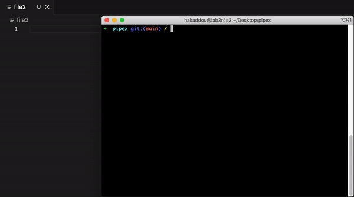

<div align="center">
<a href="https://github.com/hadi14250">
    
  </a>
  <h3 align="center">Pipex</h3>
  Pipes, forks, processes, and redirection — built from scratch in C.
  <br>
  <br>
</div>


<div align="center">
<a href="https://github.com/hadi14250">
    
  </a>


</div>

<br>


# Pipex

Pipex recreates the behavior of a Unix shell pipeline from scratch in C. Given an input file, two commands, and an output file, it reproduces exactly what your shell does when you type:

```sh
< infile cmd1 | cmd2 > outfile
```

It builds up from raw process creation and file descriptor redirection to coordinating two programs that communicate through a pipe — leaning on the core Unix system calls `fork`, `pipe`, `dup2`, `execve`, and `wait` to spawn children, wire their I/O together, resolve binaries against `PATH`, and clean everything up once the commands finish.

<br>

## Features

- Full `cmd1 | cmd2` pipeline emulation between two arbitrary binaries.
- `PATH` resolution for command lookup, just like your shell.
- Proper file descriptor wiring with `dup2` and zero leaks.
- Defensive error handling for missing files, invalid commands, and failed syscalls.

<br>

## Build & Run

From the project root:

```sh
make
./pipex input_file "cmd1" "cmd2" output_file
```

**Example**

```sh
./pipex file1 "ls -la" "grep pipex" file2
```

This is equivalent to the shell pipeline:

```sh
< file1 ls -la | grep pipex > file2
```

<br>

## How it works

1. **Parse** the four arguments — input file, two command strings, output file.
2. **Open** the input file for reading and the output file for writing (creating or truncating as needed).
3. **Pipe** — create an anonymous pipe to connect the two child processes.
4. **Fork** twice, once per command. Each child uses `dup2` to redirect its stdin and stdout to the right end of the pipe or to the input/output file, then calls `execve` on the resolved binary.
5. **Wait** in the parent for both children to finish, close every file descriptor, and free all allocated memory.

<br>

## Key concepts practiced

- Process creation and lifecycle management with `fork` and `wait`.
- Inter-process communication through anonymous pipes.
- File descriptor manipulation and redirection with `dup2`.
- Resolving and executing external binaries via `PATH` and `execve`.
- Defensive error handling for missing files, invalid commands, and failed system calls.

<br>
